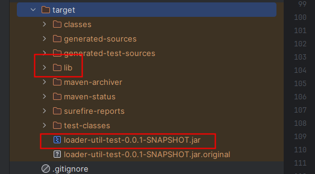

# loader-util 动态编译、加载、执行工具

[](https://jitpack.io/#com.gitee.wb04307201/loader-util)

## 代码示例
1. 使用[动态编译加载执行工具](https://gitee.com/wb04307201/loader-util)实现的[动态编译加载执行工具示例代码](https://gitee.com/wb04307201/loader-util-test)
2. 使用[动态调度](https://gitee.com/wb04307201/dynamic-schedule-spring-boot-starter)、[消息中间件](https://gitee.com/wb04307201/message-spring-boot-starter)、[动态编译加载执行工具](https://gitee.com/wb04307201/loader-util)、[实体SQL工具](https://gitee.com/wb04307201/sql-util)实现的[在线编码、动态调度、发送钉钉群消息、快速构造web页面Demo](https://gitee.com/wb04307201/dynamic-schedule-demo)

## 第一步 增加 JitPack 仓库
```xml
<repositories>
    <repository>
        <id>jitpack.io</id>
        <url>https://jitpack.io</url>
    </repository>
</repositories>
```

## 第二步 引入jar
1.1.0版本后升级到jdk17 SpringBoot3+
```xml
<dependency>
    <groupId>com.gitee.wb04307201</groupId>
    <artifactId>loader-util</artifactId>
    <version>1.1.3</version>
</dependency>
```

## 第三步 如何使用
## 1. DynamicBean 动态编译加载Bean并执行
> 使用DynamicBean需要配置@ComponentScan，包括cn.wubo.loader.util.SpringContextUtils文件
```java
    @GetMapping(value = "/test/bean")
    public String testBean(){
        String javaSourceCode = "package cn.wubo.loader.util;\n" +
                "\n" +
                "public class TestClass {\n" +
                "    \n" +
                "    public String testMethod(String name){\n" +
                "        return String.format(\"Hello,%s!\",name);\n" +
                "    }\n" +
                "}";
        String fullClassName = "cn.wubo.loader.util.TestClass";
        String methodName = "testMethod";
        String beanName = DynamicBean.init(DynamicClass.init(javaSourceCode,fullClassName)).load();
        return (String) MethodUtils.invokeBean(beanName,methodName,"world");
    }
```

## 2. DynamicClass 动态编译加载Class并执行
```java
    @GetMapping(value = "/test/class")
    public String testClass(){
        String javaSourceCode = "package cn.wubo.loader.util;\n" +
                "\n" +
                "public class TestClass {\n" +
                "    \n" +
                "    public String testMethod(String name){\n" +
                "        return String.format(\"Hello,%s!\",name);\n" +
                "    }\n" +
                "}";
        String fullClassName = "cn.wubo.loader.util.TestClass";
        String methodName = "testMethod";
        DynamicClass dynamicClass = DynamicClass.init(javaSourceCode, fullClassName).compiler();
        Class<?> clasz = dynamicClass.load();
        return (String) MethodUtils.invokeClass(clasz, methodName, "world");
    }
```

## 3. DynamicJar 动态加载外部jar并执行
```java
    @GetMapping(value = "/test/jar")
    public String testJar(){
        Class<?> clasz = DynamicJar.init("D:\\maven-repository\\repository\\cn\\hutool\\hutool-all\\5.3.2\\hutool-all-5.3.2.jar").load("cn.hutool.core.util.IdUtil");
        return (String) MethodUtils.invokeClass(clasz, "randomUUID");
    }
```

## 4. DynamicGroovy 动态编译加载Groovy并执行
```java
    @GetMapping(value = "/loadAndInvokeGroovy")
    public String loadAndInvokeGroovy() {
        String javaSourceCode = "package cn.wubo.loader.util;\n" +
                "\n" +
                "public class TestClass {\n" +
                "    \n" +
                "    public String testMethod(String name){\n" +
                "        return String.format(\"Hello,%s!\",name);\n" +
                "    }\n" +
                "}";
        String methodName = "testMethod";
        Class<?> clasz = DynamicGroovy.init(javaSourceCode).load();
        return (String) MethodUtils.invokeClass(clasz, methodName, "world");
    }
```

## 5. DynamicController 动态编译加载Controller并执行
```java
    @GetMapping(value = "/loadController")
    public String loadController() {
        String fullClassName = "cn.wubo.loaderutiltest.DemoController";
        String javaSourceCode = """
            package cn.wubo.loaderutiltest;

            import lombok.AllArgsConstructor;
            import lombok.Data;
            import lombok.NoArgsConstructor;
            import org.springframework.web.bind.annotation.GetMapping;
            import org.springframework.web.bind.annotation.RequestMapping;
            import org.springframework.web.bind.annotation.RequestParam;
            import org.springframework.web.bind.annotation.RestController;

            @RestController
            @RequestMapping(value = "test")
            public class DemoController {

                @GetMapping(value = "hello")
                public User hello(@RequestParam(value = "name") String name) {
                    return new User(name);
                }

                @Data
                @AllArgsConstructor
                @NoArgsConstructor
                public static class User {
                    private String name;
                }
            }
                            """;
        return DynamicController.init(DynamicClass.init(javaSourceCode, fullClassName)).load();
    }
```
```http request
GET http://localhost:8080/test/hello?name=world
Accept: application/json

Hello,world!
```

## 6. proxy 动态代理切面
```java
    @GetMapping(value = "/testAspect")
    public String testAspect() throws InstantiationException, IllegalAccessException {
        String javaSourceCode = "package cn.wubo.loader.util;\n" +
        "\n" +
        "public class TestClass {\n" +
        "    \n" +
        "    public String testMethod(String name){\n" +
        "        return String.format(\"Hello,%s!\",name);\n" +
        "    }\n" +
        "}";
        String fullClassName = "cn.wubo.loader.util.TestClass";
        String methodName = "testMethod";
        DynamicClass dynamicClass = DynamicClass.init(javaSourceCode, fullClassName).compiler();
        Class<?> clasz = dynamicClass.load();
        Object obj = MethodUtils.proxy(clasz.newInstance());
        return (String) MethodUtils.invokeClass(obj, methodName, "world");
    }
```
输出示例
```text
2023-04-08 21:22:14.174  INFO 32660 --- [nio-8080-exec-1] cn.wubo.loader.util.aspect.SimpleAspect  : SimpleAspect before cn.wubo.loader.util.TestClass testMethod
2023-04-08 21:22:14.175  INFO 32660 --- [nio-8080-exec-1] cn.wubo.loader.util.aspect.SimpleAspect  : SimpleAspect after cn.wubo.loader.util.TestClass testMethod
2023-04-08 21:22:14.175  INFO 32660 --- [nio-8080-exec-1] cn.wubo.loader.util.aspect.SimpleAspect  : StopWatch 'cn.wubo.loader.util.TestClass testMethod': running time = 65800 ns
```

可以通过继承IAspect接口实现自定义切面，并通过MethodUtils.proxy(Class<?> clazz, Class<? extends IAspect> aspectClass)方法调用切面

## DynamicClass如何在服务器上运行
因为本地和服务器的差异导致classpath路径不同，  
进而使服务上动态编译class时会发生找不到import类的异常，  
因此需要对maven编译配置和启动命令做出一定的修改  
### 1. maven编译配置增加如下部分
```xml
            <plugin>
                <groupId>org.apache.maven.plugins</groupId>
                <artifactId>maven-jar-plugin</artifactId>
                <configuration>
                    <archive>
                        <manifest>
                            <!-- 是否要把第三方jar加入到类构建路径 -->
                            <addClasspath>true</addClasspath>
                            <!-- 外部依赖jar包的最终位置 -->
                            <classpathPrefix>lib/</classpathPrefix>
                            <!--指定jar程序入口-->
                            <mainClass>cn.wubo.loaderutiltest.LoaderUtilTestApplication</mainClass>
                        </manifest>
                    </archive>
                </configuration>
            </plugin>
            <plugin>
                <groupId>org.apache.maven.plugins</groupId>
                <artifactId>maven-dependency-plugin</artifactId>
                <executions>
                    <execution>
                        <id>copy-dependencies</id>
                        <phase>package</phase>
                        <goals>
                            <goal>copy-dependencies</goal>
                        </goals>
                        <configuration>
                            <!-- lib依赖包输出目录，打包的时候不打进jar包里 -->
                            <outputDirectory>${project.build.directory}/lib</outputDirectory>
                            <excludeTransitive>false</excludeTransitive>
                            <stripVersion>false</stripVersion>
                            <includeScope>runtime</includeScope>
                        </configuration>
                    </execution>
                </executions>
            </plugin>
```
### 2. 执行编译命令，会在jar包的同级目录下生成lib文件夹存放依赖包

### 3. 将jar包和lib文件夹上到服务器，并在启动命令中增加`-Dloader.path=lib/`
```shell
java -jar -Dloader.path=lib/ loader-util-test-0.0.1-SNAPSHOT.jar
```

